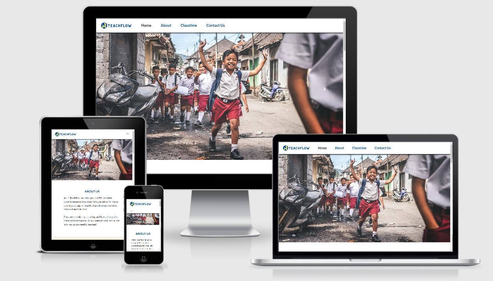
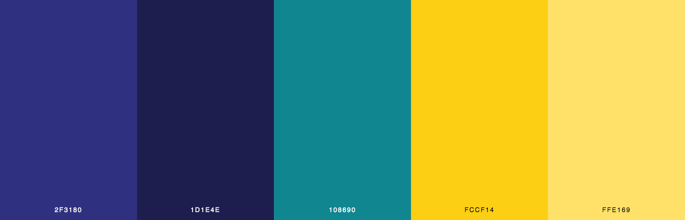

# TeachFlow Website

## Interactive Frontend Development 

[View the Live Site here.](https://emmahartedev.github.io/TeachFlow/)

 



Teachflow is a fictitious company, providing support, information and materials to two groups of poeple.
a) Those considering ESL teaching in Asia &
b) Those who are already working in as ESL teachers.

The purpose of this project to create a one-stop-shop of information for ESL teachers. 
The website focuses on providing information on 4 destination countries. Additional countries may be added in future releases.
Teaching materials are also featured on the website and can be accessed by entering a link. This leads to the classroom portal.
Class material includes flashcards, a song lesson and a memory game. 

Important information and features to the company include: 

* Providing information on 4 Asian countries
* Providing a class lesson (game and flashcards)
* Providing information on ESL teaching
* Including a contact form, a long term goal is to build up a network of ESL teachers who may use the 'Classtime' portal. 

----------------------------

## Contents
1. [UX](#ux "goto-ux")
    * [Overview](#overview "goto overview")
    * [User Stories](#user-stories "goto user stories")
    * [Project Scope](#project-scope "goto project scope")
    * [Design](#design "goto design")
    * [Wireframes](#wireframes "goto wireframes")

2. [Features](#features "goto features")
    * [Existing Features](#existing-features "goto existing features")
    * [Features Left to Implement](#features-left-to-implement "goto features left to implement")

3. [Technology Used](#technology-used "goto technology used")

4. [Testing](https://github.com/emmahartedev/ms2-teachflow/blob/master/testing.md)
    
5. [Deployment](#deployment "goto deployment")

6. [Credits](#credits "goto credits")
    * [Contents](#code "goto code")
    * [Code](#code "goto code")
    * [Media](#media "goto media")
    * [Acknowledgments](#acknowledgments "goto acknowledgments")

----------------------------

## UX

### Overview
TeachFlow aims to provide users with honest and thorough ESL teaching-related information. 
In this release, as well as featuring in depth information about teaching in Asia, a virtual classroom will be incorporated. 
This aims to give users a realistic impression of what a typical class lesson would entail. 
In future releases, 'Classtime' may be further developed and TeachFlow may charge for access to this material. 

By creating an in-depth ESL information hub, TeachFlow hopes to promote ESL teaching as a career, post Coronavirus lock-downs. 

### User Stories

#### Potential ESL Teacher Goals
As a potential ESL teacher:
* I am looking for information on ESL countries, so that I can find out what appeals to me.
* I usually do all my research on my phone, so I would like the website to be mobile responsive.
* I am looking for information about a typical class lesson, so that I can learn about a typical day on the job. 
* I would like to be able to contact the website owners if I have any questions about the content.
* I would like to see the requirements for becoming an ESL teacher; the salary and benefits.

#### Current ESL Teacher Goals
As a current ESL Teacher:

* I would like to see information on regions in countries as I am familiar the countries do not give me indepth information. 
* I would like to see some interactive information about the countries, such as the current weather or statistics so that I am receiving live, updated information. 
* I would like any class material featured to be focused on learning English words and improving students speaking skills. 
* I would like to be able to sign up to a newsletter. 

### Project Scope
Based on the above user stories, the following are features that will be included in this release:

* A newsletter signup.
* A maps API which will show 4 countries in Asia.
* A contact us form, for users who would like to learn more about ESL teaching.
* A Map & Interactive Information on ESL countries which is created using an API.
* A simple memory game focused on speaking English words.
* Flashcard / a song focused on learning vocabulary.

The following is a list of features that will not be included in this release: 

* More than one lesson plan.
* Functionality to enter a zip code on maps.
* Custom designed maps with colours or detailed markers. 
* Coronavirus adapted ESL content.
* A save high score function on the memory game.

### Design

#### Typography
All fonts used are from [Google Fonts](https://fonts.google.com/). 

Fonts used include:
* Roboto (regular 400) - used for body text.
* Lato (700) - used for headings (H1 - H6).

#### Colour Scheme
A blue/yellow color palette was used which creates a bright undertone and compliments the striking imagery well. 



The Colours above were used for inspiration.
In this project, the following shades were used:

* Blue (#034cae)
* Dark blue (#070958)
* Teal (#246e74)
* Light yellow (#fef7dd)
* Dark yellow (#fccf14)

#### Imagery
* A carousel banner is used in index.html. This contains 3 striking images that focus on ESL teaching.
* A Hero Image is used in game.html. This focuses on ESL teaching; the classroom. 
* In game.html, multiple animal images are used and re-used throughout the class lesson. 
    This is done intentionally, as reusing material to reinforce learning is common practice in teaching. 

#### Design justifications
* 'Home', 'About' & 'Contact us' are all sections on index.html. In doing this, a strong index.html is strengthened. The pathway shows company information, ESL teaching information, and finally a contact form.   
* Classtime is created as a stand-alone page (game.html). This is done, as 'Classtime' is a separate experience and the page is heavy with content.  

### Wireframes
All wireframes were created using the software [Balsamiq](https://balsamiq.com/). 
Layouts were created following research on the five planes of UX, and before coding.

<strong>
Please note, the final website layout contains slight variations to the original wireframes.
Each of the following files contain wireframes for desktop, tablet, and mobile devices.
</strong>


* [Home Page](assets/wireframes/home.png)
* [About](assets/wireframes/about.png)
* [Contact us](assets/wireframes/contact.png)
* [Classtime](assets/wireframes/classtime.png)

--------------------------------------------------------------------------------------------

## Features

### Existing Features 
* **Navigation** 
    * The navigation contains the brand logo (anchor tag to the homepage) with four links. 
        3 links, connect to sections on index.html (home, about & contact us). 1 link, connects to a separate page (game.html). 
    * For mobile devices, the navbar collapses to a toggler button.
    * The navbar is fixed, disappears on scroll down, and reappears on scroll up. 
    * The navigation was created using [Bootstrap](https://getbootstrap.com/) and [Javascript](https://www.w3schools.com/js/DEFAULT.asp).

* **Maps API**
    * The user is able to explore 4 Asian countries using a Maps API.
    * 3 markers showing popular cities to teach ESL in are featured on each map.
    * Information and statistics are displayed alongside each map. 
    * [Javascript](https://www.w3schools.com/js/DEFAULT.asp) and [Leaflet maps](https://leafletjs.com/) were used to create this feature.

* **Contact Us Form**
    * The contact form includes fields for name, email address, and message text area.
    * A newsletter signup option is included.
    * Once a message has been submitted, the form collapses and a confirmation message is displayed.
    * [EmailJS](https://www.emailjs.com/) and [Bootstrap](https://getbootstrap.com/) were used to to create this feature.

* **Flashcards**
    * 4 animal flashcards, which onclick play a sound are featured. 
    * Duration for this lesson is listed at 15 minutes.
    * Flashcard sizes decrease with smaller device sizes.
    * [Javascript](https://www.w3schools.com/js/DEFAULT.asp) was used to create the onclick playsound function. 

* **Song lesson**
    * A youtube video (iframe) and content block create the song lesson. 
    * Duration for the lesson is listed at 20 - 30 minutes.
    * The iframe size decreases with smaller device sizes.

* **Memory Game**
    * The memory game re-uses the flashcard animal tiles.
    * Game instructions are accessible by clicking on a button. 
    * There are 15 rounds. A random tile is selected and added to each new round. 
    * First, the sequence of tiles is played by the computer, then the player's turn begins. 
    * In the player's turn, pressing a tile plays the animal audio file and activates a coloured tile. 
    * The index of each tile pressed is compared to the index of the actual tile in the sequence.
        If correct, the game continues. If incorrect, the game resets. 
    * If the player completes 15 rounds, they win and the game ends. 
    * The 'Rounds Remaining' & 'Taps left' in each round are calculated and displayed on the screen.
    * [SweetAlert](https://sweetalert.js.org/) is used to create an aesthetic alert box.
    * [Javascript](https://www.w3schools.com/js/DEFAULT.asp) was used to create the memory game.
   
* **Footer**
    * Copyright information is included in the footer left.
    * Social media links are visible on the footer right.
    * The footer was created using [Bootstrap](https://getbootstrap.com/).

### Features Left to Implement
The following are features were not included in this release. These may be developed in the future:

* Use of an API to create the map information:
    This would ensure that all data is up to date and accurate. 
    Unfortunately, I was not able to find an API that would display the right information. 

* Use of an API for real-time weather:
    This was intended as a stretch goal for this release. Due to time pressures, I was not able to include this feature.  

* Sending an automatic reply to the user after they submit a contact form:
    I was not able to research this fully, due to time pressure in this project. 

* An API that will include ESL jobs in the 4 featured Asian countries:
    This was out of scope for this project.

----------------------------

## Technology Used

* [HTML5](https://www.w3schools.com/html/) - Used for structuring the site pages.

* [CSS](https://www.w3schools.com/css/) - Used for styling the site pages.

* [Bootstrap 4](https://getbootstrap.com/) - Framework used for building the site pages.

* [Javascript](https://www.w3schools.com/js/DEFAULT.asp) - Used to make the website interactive.

* [jQuery](https://jquery.com/) - Used to make the website interactive.

* [Leaflet](https://leafletjs.com/) - Used to create the maps.

* [SweetAlert](https://sweetalert.js.org/) - Used to create pretty alert boxes.

* [EmailJS](https://www.emailjs.com/) - Used to create the email service.

* [Google Fonts](https://fonts.google.com/) - Used for typography.

* [Adobe Photoshop](https://www.adobe.com/de/products/photoshop.html?sdid=88X75SKP&mv=search&ef_id=EAIaIQobChMI95Sd8Zyv7QIVA893Ch3SYQCaEAAYASAAEgI41vD_BwE:G:s&s_kwcid=AL!3085!3!341205896389!e!!g!!adobe%20photoshop!1419109629!54636022246&gclid=EAIaIQobChMI95Sd8Zyv7QIVA893Ch3SYQCaEAAYASAAEgI41vD_BwE) - Used to resize and edit images including the company logo and game tiles.

* [Font Awesome](https://fontawesome.com/) - Used for all Icons.

* [Gitpod](https://www.gitpod.io/docs/) - Used as a development environment.

* [Github](https://github.com/) - Used for repository hosting.

* [Github Pages](https://pages.github.com/) - Used for site deployment.

* [Chrome Dev tools](https://developers.google.com/web/tools/chrome-devtools) - Used for monitoring the responsiveness of the website.

* [LamdaTest](https://www.lambdatest.com/) - Used for monitoring the responsiveness of the website.

----------------------------
## Testing
All testing documentation is stored in a separate testing file, which can be accessed [here](https://github.com/emmahartedev/ms2-teachflow/blob/master/testing.md).

----------------------------

## Deployment
The website was hosted on Github Pages. It was deployed by carrying out the following steps:

1. login into Github.
2. Select the repository from the profile.
3. go to 'settings' in the repository.
4. In 'Github Pages' choose 'Master Branch' as Source and save.

The Live site deployed can be viewed on the following link: 
[TeachFlow](https://emmahartedev.github.io/ms2-teachflow/)

### Local
To clone this project locally; a Chrome browser and Github account are required. 

The following steps can then be followed:
1. Install the [Gitpod Browser Chrome Extention](https://chrome.google.com/webstore/detail/gitpod-dev-environments-i/dodmmooeoklaejobgleioelladacbeki), restarting the browser after installation.
2. Log into [Gitpod](https://gitpod.io/).
3. Click on the following link to go to the [project repository](https://github.com/emmahartedev/living-landscapes).
4. Click on the green 'Gitpod' button (which is located to the right of the repository) to launch a new workspace.
5. The code can be worked on in this newly launched workspace. 

To clone code within an IDE of your choice:

1. Click on the following link to go to the [project repository](https://github.com/emmahartedev/ms2-teachflow).
2. Click 'Code' and in the Clone with HTTPs, copy the provided repository URL. 
3. Open a terminal in your IDE.
4. Change the current working directory to the location you wish to generate the cloned directory.
5. Type ```git clone```, and then paste the URL from step 2. 

```
git clone https://github.com/emmahartedev/ms2-teachflow.git
```

----------------------------

## Credits 
The following material is not my own. Sources have been listed alongside a description of the content used. 

### Content
* Map information 
    * Capital city, salary, requirements & benefits.
    * Source: [Go Overseas](https://www.gooverseas.com/teach-abroad)

### Audio
* Animal names (mp3) used in game.html 
    * these mp3 files are used in the flashcard and memory game section.
    * Source: [Voice Maker](https://voicemaker.in/) (Joanna, Female) used to create all files. 

### Code
The following websites were used for inspiration and assistance:
* [CSS Tricks](https://css-tricks.com/)
* [Stack Overflow](https://stackoverflow.com/)
* [Bootstrap Documentation](https://getbootstrap.com/docs/4.5/getting-started/introduction/)

The following scripts/plugins were used in the project:
* [SweetAlert](https://sweetalert.js.org) - used for popup messages
* [Grow hover effect](https://ianlunn.github.io/Hover/) - used on footer icons

The following code has been directly used in this project:

* Switch div display
    * Used to switch the 3 'game-container' divs in game.html for mobile view.
    * Source: [code](https://stackoverflow.com/questions/17115995/what-is-the-best-way-to-move-an-element-thats-on-the-top-to-the-bottom-in-respo)

* Smooth scrolling
    * Used to create a smooth-scrolling effect on index.html.
    * Source: [code](https://www.w3schools.com/jquery/tryit.asp?filename=tryjquery_eff_animate_smoothscroll)

* Full page Tabs
    * Idea used to display the map and info contents on button click.
    * Source: [code](https://www.w3schools.com/howto/howto_js_full_page_tabs.asp)

###  Media
The images used on this website were obtained from the following sources:
<strong>
(the image alt attribute is used to describe each image)
</strong>

In index.html: 
* Students in a classroom: [Source](https://www.pexels.com/photo/three-toddler-eating-on-white-table-1001914/)
* Teacher writing on blackboard: [Source](https://www.pexels.com/photo/woman-in-red-long-sleeve-writing-on-chalk-board-3769714/)
* Student outside looking to sky: [Source](pexels-artem-beliaikin-1565521)
* Woman walking up a temple path: [Source](https://www.pexels.com/photo/woman-in-blue-dress-walking-on-concrete-staircase-leading-to-buildings-929168/)
* Child in Classroom:  Owned by me

In game.html:
* Students running outside: [Source](https://www.pexels.com/photo/boy-in-white-and-red-school-uniform-raising-hands-outdoors-1153976/)
* Chicken: [Source](https://unsplash.com/photos/auijD19Byq8)
* Duck: [Source](https://unsplash.com/photos/kCZSzqvIei4)
* Cow: [Source](https://unsplash.com/photos/etrxob-VZRs)
* Pig: [Source](https://unsplash.com/photos/W7uMPs8aeXs)
* Finger Family Farm Animals Song: [Source](https://www.youtube.com/watch?v=MaHWFODvtfU&feature=emb_logo)

### Acknowledgments
* 