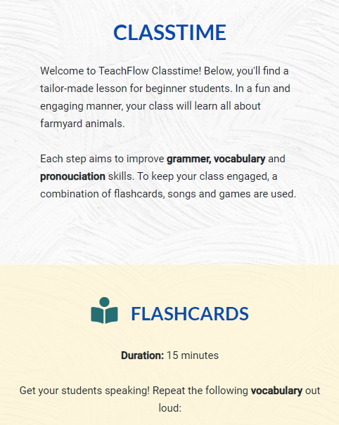
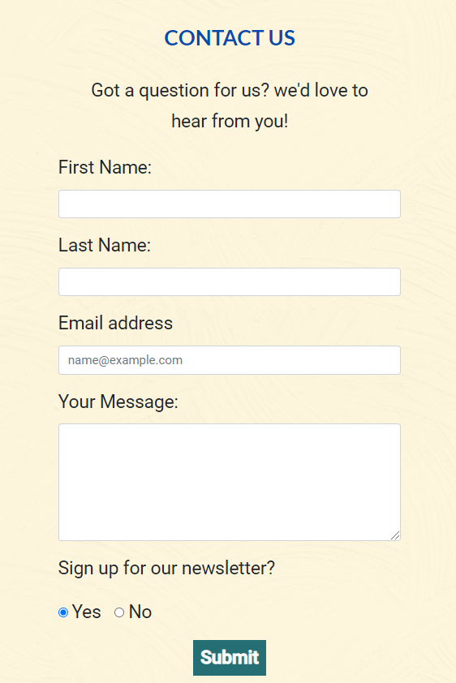
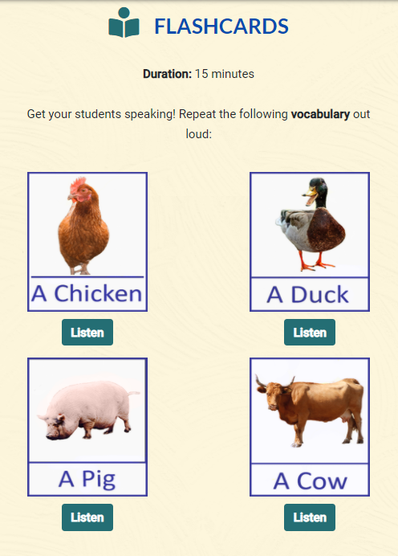

# TeachFlow Website

## Interactive Frontend Development 

[View the Live Site here.](https://emmahartedev.github.io/ms2-teachflow/)

 


Teachflow is a fictitious company, providing support, information and materials to poeple considering ESL teschin in Asia, or to those who are already working in the field.

The purpose of this project to create a one-stop-shop of information for ESL teachers. 
The website highlights a selection of 4 destination countries, with information for potential ESL teachers. Additional countries may be added in future releases.
Teaching materials are also highlighted which include a game and flashcards, a class lesson. 

Important information and features to the company include: 

* providing information on 4 Asian countries
* Providing a class lesson (game and flashcards)
* Providing information on ESL teaching

----------------------------

## Contents
1. [UX](#ux "goto-ux")
    * [Overview](#overview "goto overview")
    * [User Stories](#user-stories "goto user stories")
    * [Project Scope](#project-scope "goto project scope")
    * [Design](#design "goto design")
    * [Wireframes](#wireframes "goto wireframes")

2. [Features](#features "goto features")
    * [Existing Features](#existing-features "goto existing features")
    * [Features Left to Implement](#features-left-to-implement "goto features left to implement")

3. [Technology Used](#technology-used "goto technology used")

4. [Testing](#testing "goto testing")
    * [User Story Testing](#user-story-testing " goto user story testing")
    * [Browser Compatibility](#browser-compatibility "goto browser compatibility")
    * [Responsiveness](#responsiveness "goto responsiveness")
    * [W3C Validation](#w3c-validation "goto w3c validation")
    * [Bugs](#bugs "goto bugs")
    
5. [Deployment](#deployment "goto deployment")

6. [Credits](#credits "goto credits")
    * [Contents](#code "goto code")
    * [Code](#code "goto code")
    * [Media](#media "goto media")
    * [Acknowledgments](#acknowledgments "goto acknowledgments")

----------------------------

## UX

### Overview
TeachFlow aims to provide users with a personal and thorough resources for ESL teaching. 
By highlights both the personal and financial benefit to ESL teaching, the website aims to promote the experience for when the Coronavirus lock-downs end. 

### User Stories

#### Potential ESL Teacher Goals
As a potential ESL teacher:
* I am looking for information on ESL countries so that I can find out what appeals to me.
* I usually do all my reseach on my phone so I would like the website to be mobile responsiveness
* I am looking for information about a typical class lesson so I can learn about a typical day on the job. 
* I would like to be able to contact the website owners if I have any questions about the content.
* I would like to see the requirements for becoming an ESL teacher, the salary and benefits.

#### Current ESL Teacher Goals
As a current ESL Teacher:
* I would like to see information on regions in countries as I am familiar the countries do not give me indepth information. 
* I would like to see some interactive information about the countries, such as the current weather or statistics so that I am receiving live, updated information. 
* I would like any class material featured to be focused on learning English words and improving students speaking skills. 
* I would like to be able to sign up to a newsletter. 

### Project Scope
Based on the above user stories, the following are features that will be included:

* a newsletter signup.
* a simple memory game focused on speaking english words.
* a maps API which will show 4 countries in Asia.
* a contact us form, for users who who would to get more information about ESL teaching.
* Interactive Information on ESL countries which incorporates an API.

The following is a list of features that will not be included: 

* More than one lesson plan.
* functionality to enter a zip code on maps.
* custom designed maps with colors and detailed markers. 
* Coronavirus adapated ESL content.
* A save high score function on the memory game.

### Design

#### Typography
All fonts used are from [Google Fonts](https://fonts.google.com/). 

Fonts used include:
* Roboto (regular 400) - used for body text
* Lato (700) - used for headings; h1 - h6

#### Colour Scheme
A blue/yellow color palette was used which creates a bright undertone and compliments the striking imagery well. 

.

Colours used for inspiration include: Blue (2F3180) dark blue (1D1E4E) teal (108690) and Yellow(#FCCF14).
The actual colours used on the website include blue (#034cae), dark blue (#070958), teal (#246e74), yellow light (#fef7dd) and Yellow dark (#fccf14).

#### Imagery
* A carousel banner was used on index.html which contains three striking images that focus on ESL teaching.
* In game.html, the animal images used for the flashcards are re-used for the memory game. 
    This is done intentionally, as reusing material to reinfoce learning is common practice in teaching. 

#### Design justifications
* Home, About & Contact us are all sections on index.html. In doing this, a strong pathway is created which shows information the company, ESL teaching and finally a contact form.   
* Classtime is created as a seperate page (game.html). This was done, as the 'classroom' is seperate experience and the page is heavy with content.  

### Wireframes
All wireframes were created using the software [Balsamiq](https://balsamiq.com/). 
Layouts were created following research on the five planes of UX and before coding.

<strong>
Please note, the final website layout contains slight variations to the original wireframes.
Each of the following files contain wireframes for desktop, tablet and mobile devices.
</strong>

* [Home Page](assets/wireframes/home.png)
* [About](assets/wireframes/about.png)
* [Contact us](assets/wireframes/contact.png)
* [Classtime](assets/wireframes/classtime.png)

--------------------------------------------------------------------------------------------

## Features

### Existing Features 
* **Navigation** 
    * The navigation contains the brand logo (anchor tag to homepage) with four links. 
        3 links, connect to sections on index.html (home, about & contact us). 1 link, connects to a separate page (game.html). 
    * For mobile devices, the navbar collapses to a toggler button.
    * The nav bar is fixed, disappears on scroll down and reappears on scroll up. 
    * The navigation was created using [Bootstrap](https://getbootstrap.com/). 

* **Maps API**
    * The user is able to explore 4 Asian countries using the Maps API.
    * 3 markers showing popular city to teach ESL in are featured on each map.
    * Information and statistics are displayed alongside each map. 
    * [Javascript](https://www.w3schools.com/js/DEFAULT.asp) and [Leaflet maps](https://leafletjs.com/) were used to create this feature.

* **Contact Us Form**
    * The contact form includes fields for name, email address and message text area.
    * A newsletter signup option is included.
    * Once a message has been submitted, the form collapes and a confirmation message is displayed.
    * [EmailJS](https://www.emailjs.com/) and [Bootstrap](https://getbootstrap.com/) were used to to create this feature.

* **Flashcards**
    * 4 animal flashcards, which onclick play a sound are featured. 
    * Duration for the lesson is featured at 15 minutes.
    * Flashcard sizes descrease with smaller device sizes.
    * [Javascript](https://www.w3schools.com/js/DEFAULT.asp) was used to create the onclick playsound function. 

* **Song lesson**
    * A youtube video (iframe) and content block create the song lesson. 
    * Duration for the lesson is featured at 20 - 30 minutes.
    * The iframe size descrease with smaller device sizes.

* **Memory Game**
    * The memory game re-used the flashcard animal tiles
    * There are 15 rounds, with taps incrementing at each new round. 
    * An event handler allows the player to progress when the order of tiles played by them matches the order played by the computer. 
    * When the sequences do not match, the game is reset.
    * Colorful tiles are added to on hover.
    * Audio sound and colorful tiles are to on press.  
    * [SweetAlert](https://sweetalert.js.org/) is used to create an aesthetic alert box.
    * [Javascript](https://www.w3schools.com/js/DEFAULT.asp) was used to create the memory game.
   
* **Footer**
    * Copyright information is included in the footer center.
    * Social media links are visible on the footer right.
    * The footer was created using [Bootstrap](https://getbootstrap.com/).

### Features Left to Implement
The following are features were not included in this release  

These include:
* Use an API to create the maps information. This would ensure that all data is up to date and accurate. 
    Unfortuately I was not able to find an API which would display the right information. 
* An automatic reply to be send to the user after they submit a contact form. 
* An API which will include ESL jobs in the 4 featured Asian countries. 

----------------------------

## Technology Used

* [HTML5](https://www.w3schools.com/html/) - Used for structuring the site pages.

* [CSS](https://www.w3schools.com/css/) - Used for styling the site pages.

* [Bootstrap 4](https://getbootstrap.com/) - Framework used for building the site pages.

* [Javascript](https://www.w3schools.com/js/DEFAULT.asp) - Used to make the website interactive.

* [jQuery](https://jquery.com/) - Used to make the website interactive.

* [Leaflet](https://leafletjs.com/) - Used to create the maps.

* [SweetAlert](https://sweetalert.js.org/) - Used to create pretty alert boxes.

* [EmailJS](https://www.emailjs.com/) - Used to create the email service.

* [Google Fonts](https://fonts.google.com/) - Used for typography.

* [Adobe Photoshop](https://www.adobe.com/de/products/photoshop.html?sdid=88X75SKP&mv=search&ef_id=EAIaIQobChMI95Sd8Zyv7QIVA893Ch3SYQCaEAAYASAAEgI41vD_BwE:G:s&s_kwcid=AL!3085!3!341205896389!e!!g!!adobe%20photoshop!1419109629!54636022246&gclid=EAIaIQobChMI95Sd8Zyv7QIVA893Ch3SYQCaEAAYASAAEgI41vD_BwE) - Used to resize and edit images.

* [Font Awesome](https://fontawesome.com/) - Used for all Icons.

* [Gitpod](https://www.gitpod.io/docs/) - Used as a development environment.

* [Github](https://github.com/) - Used for repository hosting.

* [Github Pages](https://pages.github.com/) - Used for site deployment.

* [Chrome Dev tools](https://developers.google.com/web/tools/chrome-devtools) - Used for monitoring the responsiveness of the website.

* [Cross Browser Testing](https://crossbrowsertesting.com/) - Used for monitoring the responsiveness of the website.

----------------------------
## Testing

### User Story Testing
In this section, the user stories which were defined in the [UX](#ux "goto-ux") section of this README document are re-evaluated.

### User Stories

#### Potential ESL Teacher Goals
As a potential ESL teacher:

* I am looking for information on ESL countries so that I can find out what appeals to me.
    * 4 Asian countries which are popular ESL destinations are focued upon, on this website release.

    * 

* I usually do all my research on my phone so I would like the website to be mobile responsive.
    * A mobile-first design approad has been adopted.

    * 

* I am looking for information about a typical class lesson so I can learn about a typical day on the job.
    * An entire class lesson is provided in game.html which gives the user a clear idea of what a typical class lesson looks like.

    * 

* I would like to be able to contact the website owners if I have any questions about the content.
    * A contact form is available on index.html.

    * 

* I would like to see the requirements for becoming an ESL teacher, the salary and benefits.
    * Requirements, salary and additional information is featured in the country maps information section.

    * 

#### Current ESL Teacher Goals
As a current ESL Teacher:

* I would like to see information on regions in countries as I am familiar the countries do not give me indepth information. 
    * 3 Markers have been placed on each map, showing popular cities to teach in. 

    * 


* I would like to see some interactive information about the countries, such as the current weather or statistics so that I am receiving live, updated information. 
    * Due to time limitation, a weather API was not integrated into this release. 
    * Country info however can be seen in the country maps information section.

    * 


* I would like any class material featured to be focused on learning English words and improving students speaking skills. 
    * Multipe content is featured including flashcards, a song lesson and a memory game.

    * 


* I would like to be able to sign up to a newsletter. 
    * Newsletter signup option is offered on the contact us form.

    * 

### Browser Compatibility
The website was viewed on the following browsers:
* Google Chrome
* Firefox
* Microsoft Edge
* Safari
* Opera


[Cross Browser Testing](https://crossbrowsertesting.com/) 


### Responsiveness
The website's responsiveness was tested using [Chrome Dev Tools](https://developers.google.com/web/tools/chrome-devtools).
The devices tested and screen with include: 
    * iPhone 5/SE (320px)
    * iPhone 6/7/8 (375px)
    * iPhone 6/7/8 Plus (414px)
    * iPad (768px)
    * iPad Pro (1024px)
    * Laptop (1200px)
    * Desktop (1920px)
    
In addition to this, [Lighthouse](https://developers.google.com/web/tools/lighthouse) was run in Chrome Dev Tools, to generate reports on the quality of the website.

### W3C Validation
The validity of each page's HTML code was checked using [The W3C Markup Validation Service](https://validator.w3.org/).
The following code changes were made to satisfy the validator:


The validity of the CSS code was checked using [The W3C CSS Validation Service](https://jigsaw.w3.org/css-validator/).


### Bugs

- js code hash interferring with contact page
https://stackoverflow.com/questions/59706410/link-with-anchor-to-different-page-href

hide the nav bar when scrolling down - fixes the anchor link issue which cuts off top of section 

/* switch the three game divs for mobile view */
/* credit https://stackoverflow.com/questions/17115995/what-is-the-best-way-to-move-an-element-thats-on-the-top-to-the-bottom-in-respo */
/* credit https://sweetalert.js.org/*/
/* credit: https://www.w3schools.com/jquery/tryit.asp?filename=tryjquery_eff_animate_smoothscroll

// hide nav bar on scrolling
// CREDIT: https://bootstrap-menu.com/detail-smart-hide.html

//------------------ function to display the map and info contents ------------ //
/* inspiration CREDIT https://www.w3schools.com/howto/howto_js_full_page_tabs.asp*/

@media (max-width: 1200px) { /* switch the three game divs for mobile view */
/* credit https://stackoverflow.com/questions/17115995/what-is-the-best-way-to-move-an-element-thats-on-the-top-to-the-bottom-in-respo */

----------------------------

## Deployment

The website was hosted on Github Pages. It was deployed by carrying out the following steps:

1. login into Github.
2. Select the repository from the profile.
3. go to 'settings' in the repository.
4. In 'Github Pages' choose 'Master Branch' as Source and save.

The Live site deployed can be viewed on the following link: 
[TeachFlow](#)

### Local
To clone this project locally; a Chrome browser and Github account are required. 

The following steps can then be followed:
1. Install the [Gitpod Browser Chrome Extention](https://chrome.google.com/webstore/detail/gitpod-dev-environments-i/dodmmooeoklaejobgleioelladacbeki), restarting the browser after installation.
2. Log into [Gitpod](https://gitpod.io/).
3. Click on the following link to go to the [project repository](https://github.com/emmahartedev/living-landscapes).
4. Click on the green 'Gitpod' button which is located to the right of the repository to launch a new workspace.
5. The code can be worked on in this newly launched workspace. 

To clone code within an IDE of your choice:

1. Click on the following link to go to the [project repository](https://github.com/emmahartedev/living-landscapes).
2. Click 'Code' and in the Clone with HTTPs, copy the provided repository URL. 
3. Open a terminal in your IDE.
4. Change the current working directory to the location you wish to generate the cloned directory.
5. Type ```git clone```, and then paste the URL from step 2. 

```
git clone #
```

----------------------------

## Credits 

### Content
All content was written and developed by me.

### Code
The following websites were used for inspiration and assistance:

* [CSS Tricks](https://css-tricks.com/)
* [Awwwards](https://www.awwwards.com/)
* [Stack Overflow](https://stackoverflow.com/)
* [Bootstrap Documentation](https://getbootstrap.com/docs/4.5/getting-started/introduction/)

https://ianlunn.github.io/Hover/ - hover effects on icons
###  Media
The images used on this site are royalty-free and were obtained from the following websites:

* [Unsplash](https://unsplash.com/)
* [Pexels](https://www.pexels.com/de-de/)
* [Pixabay](https://pixabay.com/de/)

The company logo was generated on []().

### Acknowledgments
* 