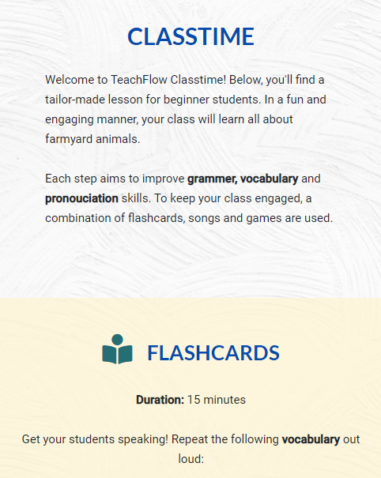
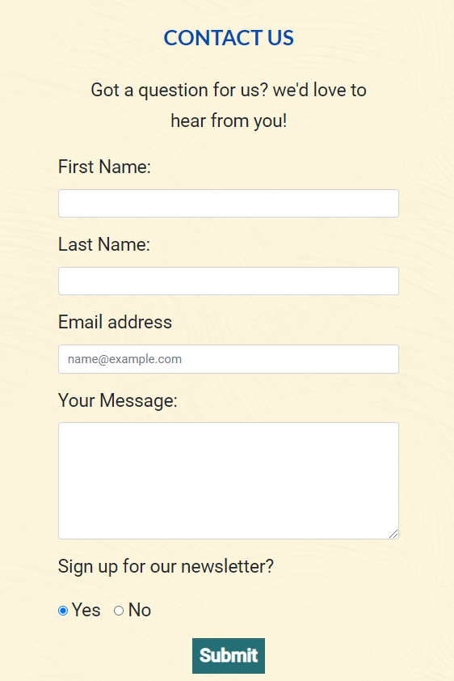
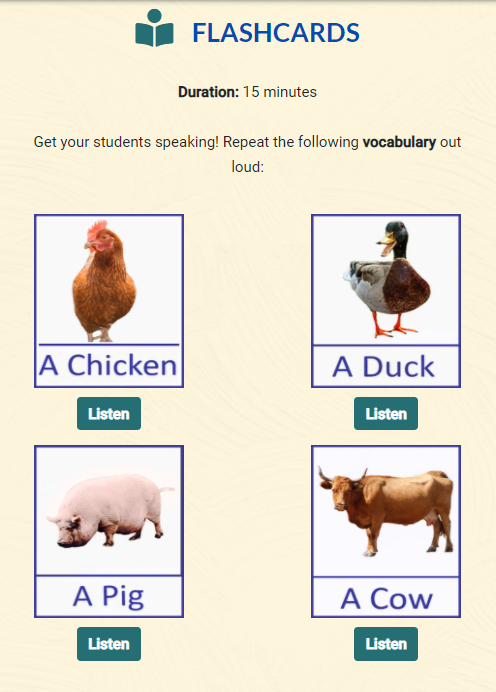
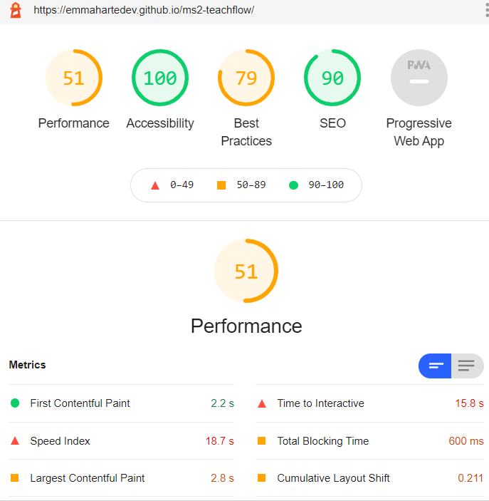
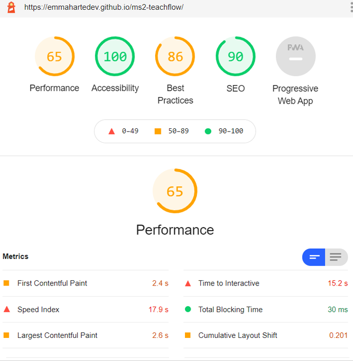
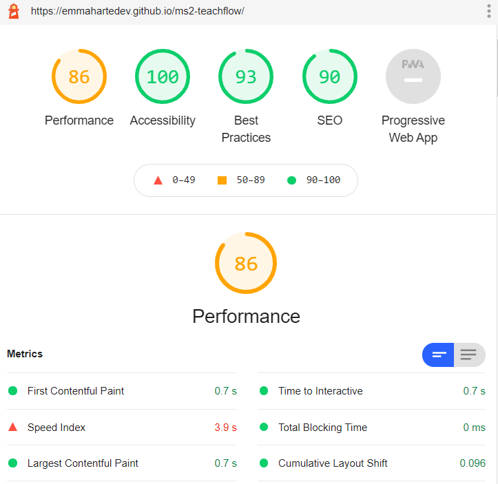

## Testing

4. Testing
    * [User Story Testing](#user-story-testing " goto user story testing")
    * [Browser Compatibility](#browser-compatibility "goto browser compatibility")
    * [Responsiveness](#responsiveness "goto responsiveness")
    * [Code Validation & Testing](#code-validation-&-testing "goto code validation & testing")
    * [Bugs](#bugs "goto bugs")

Follow this link to go back to [README.md]("https://github.com/emmahartedev/ms2-teachflow/blob/master/README.md"). 

### User Story Testing
In this section, the user stories defined in the UX section of [README.md](https://github.com/emmahartedev/ms2-teachflow/blob/master/README.md) are re-evaluated.

### User Stories
#### Potential ESL Teacher Goals
As a potential ESL teacher:

* I am looking for information on ESL countries so that I can find out what appeals to me.
    * 4 Asian countries (popular ESL destinations) are featured in the maps section on index.html. 
    * By clicking on a country, an info section is displayed. 
    * 3 markers are placed on each country. Each marker shows a popular city to teach ESL in. 
    * The screenshot below shows an example of the information and map which are displayed on click of a country. 

     

* I usually do all my research on my phone, so I would like the website to be mobile responsive.
    * A mobile-first design approach has been adopted.
    * The Bootstrap grid system provides an easy solution to creating mobile responsiveness.  
    * The screenshot below how the navbar collapses for ease of mobile use.

     

* I am looking for information about a typical class lesson so that I can learn about a typical day on the job.
    * An entire class lesson is provided in game.html which gives the user a clear idea of what a typical class lesson looks like.
    * The class lesson includes flashcards, a song, and a memory game.
    * the entire class lesson is approx. 1 hour in length. 
    * The screenshot below shows an introduction to 'Classtime' which states the learning outcomes and summaries the material on the page.  

     

* I would like to be able to contact the website owners if I have any questions about the content.
    * A contact form is available on index.html.
    * If a message has been submitted successfully, the form collapses and a confirmation message is displayed.
    * If a message fails to send, a [SweetAlert](https://sweetalert.js.org/) modal appears. The message states that there has been an error.
    * All fields are required for submission
    * The screenshot below shows the contact form.

    

* I would like to see the requirements for becoming an ESL teacher; the salary and benefits.
    * Requirements, salary and additional information is featured in the country maps information section.
    * This information is displayed when a country is selected.
    * The screenshot below shows are info section where this information is displayed.

    

#### Current ESL Teacher Goals
As a current ESL Teacher:

* I would like to see information on regions in countries as I am familiar with the countries do not give me in-depth information.
    * General country information is included in the map info section. 
    * 3 Markers have been placed on each map, showing popular cities to teach in. 
    * A pop-up is included with each marker which shoes the city name.
    * The screenshot below the map, marker, and info section for South Korea.

    

* I would like to see some interactive information about the countries, such as the current weather or statistics so that I am receiving live, updated information.  
    * Due to time limitation & project scope, a weather API was not integrated into this release. 
    * Country info however can be seen in the country maps information section.
        As this is not an API, this information would need to be updated manually. 
    * The screenshot below shows all information that is available on click of a country. 

    

* I would like any class material featured to be focused on learning English words and improving students speaking skills. 
    * Multiple content is featured including flashcards, a song lesson, and a memory game.
    * A 'Farmyard Animal' theme is used to create a realistic class lesson. 
    * The class lesson is focused on improving vocabulary, pronunciation & grammar.. 
    * Each section of the lesson includes duration recommendations. 
    * The screenshot below shows the 'Flashcard' section of 'Classtime'.

    

* I would like to be able to sign up to a newsletter. 
    * A newsletter signup option is offered on the contact us form.
    * The screenshot below shows the signup option.
    
    

### Browser Compatibility
[LamdaTest](https://www.lambdatest.com/) was used to test the website on the following browsers:

* Google Chrome
* Firefox
* Microsoft Edge
* Safari 
* Opera

Also, internet explorer was tested. As expected issues with Javascript were encountered.
In index.html, the contact form does not submit successfully. In game.html, all onclick button functions are not working. 
With these findings, I recommend that this website is not used on IE. 

### Responsiveness
The website's responsiveness was tested using [Chrome Dev Tools](https://developers.google.com/web/tools/chrome-devtools).
CSS Media Queries were written as required to improve appearances. 

The devices (and screen widths) tested with include: 
* iPhone 5/SE (320px)
* iPhone 6/7/8 (375px)
* iPhone 6/7/8 Plus (414px)
* iPad (768px)
* iPad Pro (1024px)
* Laptop (1200px)
* Desktop (1920px)
    
In addition to this, [Lighthouse](https://developers.google.com/web/tools/lighthouse) was run in Chrome Dev Tools regularly throughout developement, to generate reports on the quality of the website.
Primarily mobile reports were focused upon. 

The following report was generated before changes were made:

By correctly sizing imagery and cleaning CSS & JavaScript code, an increase in the performance rating was achieved.
It has been noted however that this rating fluctuates in every report. Going forward, it would be preferable to serve images in next gen format. At the moment, the large file sizes have a negative impact on performance. 

On Desktop, even higher scores were acheived:

### Code Validation
#### HTML 
* All HTML code was checked using [The W3C Markup Validation Service](https://validator.w3.org/).
* No errors or warnings were produced.

#### CSS
* All CSS code was checked using [The W3C CSS Validation Service](https://jigsaw.w3.org/css-validator/).
* No errors were produced. 
* 26 noncritical warnings associated with imported stylesheets and vendor extensions were produced. 

#### Javascript
* All Javascript code was checked using [JSHint](https://jshint.com/). 
* As a result, all undefined variables were found and removed. 
* Several warnings were received stating that: 'let' is available in ES6 (use 'esversion: 6') or Mozilla JS extensions (use moz). To resolve, a file named ".jshintrc"  was added to this project.

### Javascript Manual Testing 

#### General 
   * All javascript variables were logged to the console in Testing.

* Pre-loader
    * Loaded both index.html & game.html to test. 
    * Adjusted the 'fade-in' & 'fade-out' parameters were to find a balance between a delay for the user & adequate load-time.

* Navigation
    * Three anchor links (Home, About, Contact Us) are sections on index.html. 'Classtime' is a stand-alone page. Each link was clicked to test. 
    * When the jumping anchor links were clicked in the collapsed navbar window, the navbar did not close. This is documented [here](#bugs "goto-bugs").
   
* Smooth scrolling
    * Smooth scrolling is present when jumping anchor links are clicked (Home, About, Contact Us on index.html). Each link was clicked to test. 
    * No issues with smooth scrolling found in index.html.
    * In game.html, all navlinks however did not work due to the smooth scrolling code. 
        This bug is documented [here](#bugs "goto-bugs").

* Fixed navbar disappears on scroll
    * Scrolled in both directions to test. 
    * Discovered that the navbar was not appearing quick enough at the top of the page, exposing the top margin added to the carousel items. The solution is listed [here](#bugs "goto-bugs").

#### index.html

* Carousel
    * Carousel tested by both waiting for automatic cycling of items & by clicking on 'prev'/'next' buttons.
    * A bug was found on mobile devices. On smaller device sizes, half of the carousel items were cut off due to their position behind the fixed navbar.
      This is documented [here](#bugs "goto-bugs")
    
* Maps section (map and info content )
    * Clicked all four 'country' buttons, map and info content appears as expected 
    * Clicked on all markers in each country map, content appears as expected. 

* Contact us section
    * Tested successful form submission, section collapses as expected on successfully sending a message. 
    * Tested failed form submission, a modal appears with an error message as expected. 
    * Tested each 'required' field, all confirmed to be needed. 

#### game.html

* Flashcards section
    * Clicked each tile to playSound, sound plays as expected. 

* Memory Game section
    * Instructions
        * Clicked the instructions button, the toggleDisplay function runs as expected. 
        * Clicked the button again to close, no issues found. 

    * Tiles pressed (sound and activation class):
       * Clicked each tile, the activation class is applied and the audio file plays as expected. 
       * Sounds were found to be overlapping, this bug is documented [here](#bugs "goto-bugs").

    * Start game (computer round):
        * Clicked the start button. 
        * StartRound function switches 'memory game' with the round information as expected. 
        * The start button is replaced by 'Listen & watch' as expected. 
    
    * Players turn (play round):
        * 'Listen & watch' is replaced with 'your go' & taps left info, as expected. 
        * Tiles are clickable with a CSS transform property is apllied on hover, as expected.
            On touchscreen devices, the hover effects on tiles was found to be sticky. This bug is documented [here](#bugs "goto-bugs").

    * Remaining taps calculation: 
        * Clicked on the correct tile, the taps remaining (displayed on the screen) decreases by one. 
    
    * Remaining round calculation:
         * Completed a round successfully, the remaining rounds (displayed on the screen) decreases by one.
         * The last remaining round is 0, this is replayed by 'Memory Game' once the game is complete. 

    * Round successful:
        * Clicked on the correct order of tiles.
        * Start button section is replaced with a 'keep going message' as expected. 
        * StartRound function runs as expected.

    * Round unsuccessful: 
        * Pressed the wrong tile in a round. The gameOver function ran as expected, displaying an alert box with a 'Whoops' message.

    * Game completed:
        * Played 15 rounds to test gameOver function. As expected an alert box with a 'success' message is displayed and the game is restarted.

### Bugs 

#### Solved
* <strong>Navlinks in game.html not working:</strong>
The js hash code was interfering with the functionality of the nav link to game.html. While researching, I found a similar issue on [Stack Overflow](https://stackoverflow.com/questions/59706410/link-with-anchor-to-different-page-href). 
After reading this, I created a data attribute for the anchor links on index.html and targeted these only in the js hash code. The navigation then worked without any issues.

* <strong>Carousel image cut off in mobile:</strong>
On smaller device sizes, the top half of the carousel items were cut off due to their position behind the fixed navbar. To fix this, a top margin was added to the carousel items; which pushed the image down. 
After adding this code, the carousel appeared as expected. 

* <strong>Navbar Collapse not closing in index.html:</strong>
The collapsed navbar was not closing when one of the anchor links was clicked in index.html.  
To fix this, a javascript function that added & removed a show class to the navbar on click was added to general.js. This resolved the issue.

* <strong>Fixed navbar disappears on scroll: </strong>
The userScrolled function was causing the navbar to disappear for a few seconds once it reached the top of the page. 
Because of this, the carousel's margin was exposed. [Codepen](https://codepen.io/fbmiranda/pen/edqgxm) 
provided a solution to this, making sure that the user scrolls past the navbar before it disappears. After modifying the code, the bug was solved. 

* <strong>Memory Game - Tiles pressed (sound and activation class):</strong>
When iterating through each tile in a round, the longer audio files were overlapping. To fix, a timeout was set to the itertateThrough(storedRoundTiles) function. 
When tested again, the issue was fixed. 

#### Unsolved
* <strong>Memory Game - Sticky hover on touchscreen devices:</strong>
When playing the memory game on touchscreen devices, the tiles hover effect appears to stick. This is evident in both the 'computer round' & 'player's round'. 
After researching, I found that this bug is a common issue. Several work-arounds were tried including a solution provided by [CSS-Tricks](https://css-tricks.com/solving-sticky-hover-states-with-media-hover-hover/). 
Unfortunately, no solution tried resolved this issue completely. 
----------------------------